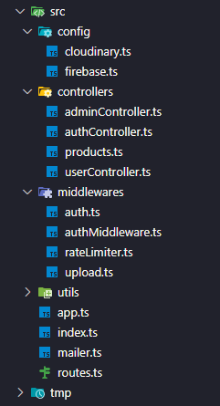

# Backend

## Visão Geral

O backend é a parte central da aplicação, responsável por toda a lógica do sistema, desde cálculos até a criação, edição, exclusão e visualização de produtos.

Além disso, é onde ocorre a integração com diversas tecnologias, permitindo que toda a aplicação funcione de forma unificada por meio de uma única API.

Atualmente, o sistema já cumpre bem sua principal função de manipulação de dados de produtos. No entanto, ainda há espaço para evolução, com novas funcionalidades sendo planejadas para ampliar as capacidades da aplicação.

Cada nova funcionalidade implementada terá sua própria documentação, que será atualizada conforme o projeto evolui e ganha escala.

No momento, existe uma API principal em funcionamento, e outra está sendo desenvolvida para disponibilizar os produtos em ambiente de testes, permitindo simular o comportamento do sistema completo com todos os dados em produção.

Atualmente, o projeto utiliza plataformas gratuitas para hospedagem, como Render para a API e Vercel para o e-commerce, enquanto o banco de dados já está online e configurado no Firebase.

---

## Tecnologias

Para o desenvolvimento desta API, foram utilizados Node.js e Express, principalmente pela simplicidade e pelo uso da mesma linguagem (JavaScript), o que facilitou o aprendizado e a produtividade da equipe durante o desenvolvimento inicial.

Essas tecnologias permitem uma construção mais rápida e flexível da API, além de serem bem adaptadas para projetos que estão em fase de crescimento e constantes mudanças.

No início do projeto, a escolha por Node.js e Express também foi influenciada pelo foco de estudo da equipe, permitindo aplicar na prática os conhecimentos adquiridos.

Com a possibilidade de crescimento do sistema, já existe um planejamento para migração futura para Spring Boot, visando maior robustez e melhor desempenho em cenários de maior escala. Junto a isso, também está prevista a mudança do banco de dados para MongoDB, buscando maior flexibilidade no armazenamento de dados.

A equipe também pretende evoluir a segurança da aplicação, tanto na API quanto no banco de dados, adotando boas práticas e novas estratégias conforme o sistema cresce.

Atualmente, o projeto ainda está em desenvolvimento e continuará recebendo novas tecnologias e funcionalidades, como agentes de IA, integração com ferramentas de analytics e a evolução da plataforma mobile interna.

---

## Arquitetura

O backend do projeto VC Brinquedos Espumados é responsável por centralizar toda a lógica da aplicação, incluindo regras de negócio, segurança, cálculos e integrações com serviços externos.

Toda a comunicação do sistema é feita por meio de uma API REST, que atende as três aplicações principais: e-commerce, dashboard e mobile.

O funcionamento ocorre da seguinte forma:

- O backend recebe requisições das aplicações (frontend, dashboard e mobile)
- A API valida a origem da requisição (URL/domínio) e verifica se ela está autorizada
- Em seguida, realiza as validações de segurança, como autenticação e verificação de permissões

Após essas validações, o comportamento varia conforme a aplicação:

- E-commerce:
  - A API permite apenas a visualização dos produtos
  - Não há acesso a rotas de manipulação de dados

- Dashboard:
  - A API verifica se o usuário está cadastrado
  - Valida o token JWT para autenticação
  - Define o nível de acesso:
    - Administradores possuem acesso completo às funcionalidades
    - Usuários comuns possuem acesso limitado

- Mobile:
  - Segue uma lógica semelhante ao dashboard
  - Permite autenticação do usuário
  - Possui acesso a determinadas funcionalidades de manipulação de dados, conforme o nível de permissão

Essa arquitetura permite que o backend tenha controle total sobre o sistema, garantindo segurança, organização e facilitando a escalabilidade das aplicações.

---

## Estrutura

### Visão geral da organização do backend:

A estrutura do backend foi organizada de forma modular, separando responsabilidades em diferentes pastas e arquivos para manter o código limpo, escalável e de fácil manutenção.

O projeto está dividido da seguinte forma:

- config  
  - Responsável pelas configurações de serviços externos, como Cloudinary (imagens) e Firebase (autenticação e banco de dados).

- controllers  
  - Contém a lógica principal das funcionalidades da API, como autenticação, gerenciamento de usuários, produtos e área administrativa.

- middlewares  
  - Responsáveis por interceptar as requisições antes de chegarem aos controllers.  
  - Incluem validações como autenticação (JWT), controle de acesso, proteção contra excesso de requisições (rate limit) e gerenciamento de uploads.

- utils  
  - Funções auxiliares reutilizáveis utilizadas em diferentes partes do sistema.

- Arquivos principais  
  - app.ts → Configuração principal da aplicação  
  - index.ts → Ponto de entrada do servidor  
  - routes.ts → Definição das rotas da API  
  - mailer.ts → Responsável pelo envio de e-mails  

- tmp  
  - Utilizado para armazenamentos temporários, como arquivos durante processos internos.

Essa organização permite que cada parte do sistema tenha uma responsabilidade bem definida, facilitando o desenvolvimento em equipe e futuras manutenções.

Por se tratar de uma API privada e de uso interno, alguns detalhes mais específicos da implementação não são expostos nesta documentação.

---

## Integração com Serviços Externos

- Cloudinary  
  - Serviço responsável pelo armazenamento de imagens enviadas pelo dashboard, retornando a URL para ser utilizada e armazenada no banco de dados.  
  - A integração foi realizada com base na documentação oficial da ferramenta, utilizando testes isolados antes da implementação final em TypeScript no sistema.

---

## Segurança

---

## Funcionalidades

---

## Rotas da API

---

## Autenticação e Autorização

---

## Banco de Dados

---

## Integração com Frontend

---

## Integração com Mobile

---

## Integração com Dashboard

---

## Deploy

---

## Melhorias Futuras

---

## Observações

A API está em constante evolução, buscando sempre incorporar novas tecnologias para otimizar os processos e o tempo da empresa.

Além disso, trata-se de uma API totalmente privada e de uso interno, não sendo disponibilizada publicamente.