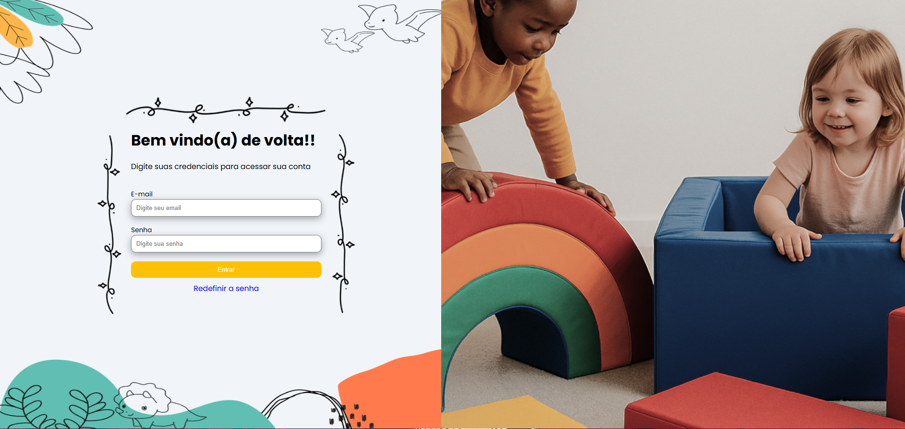
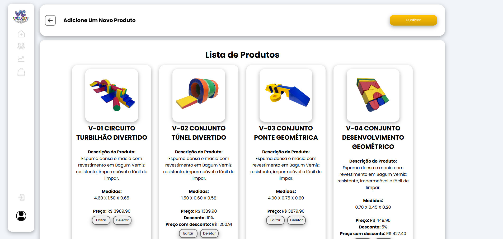
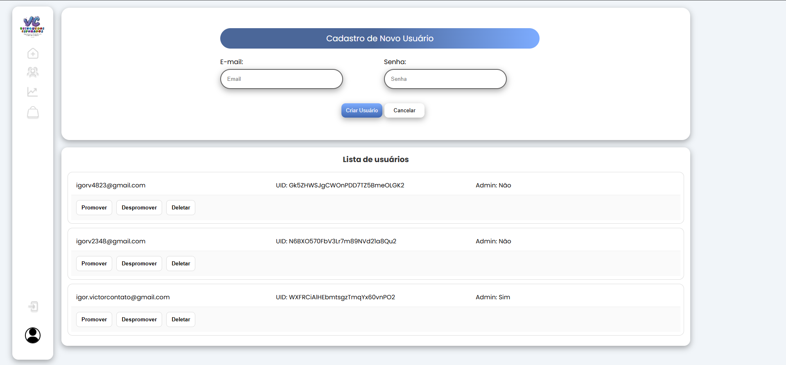
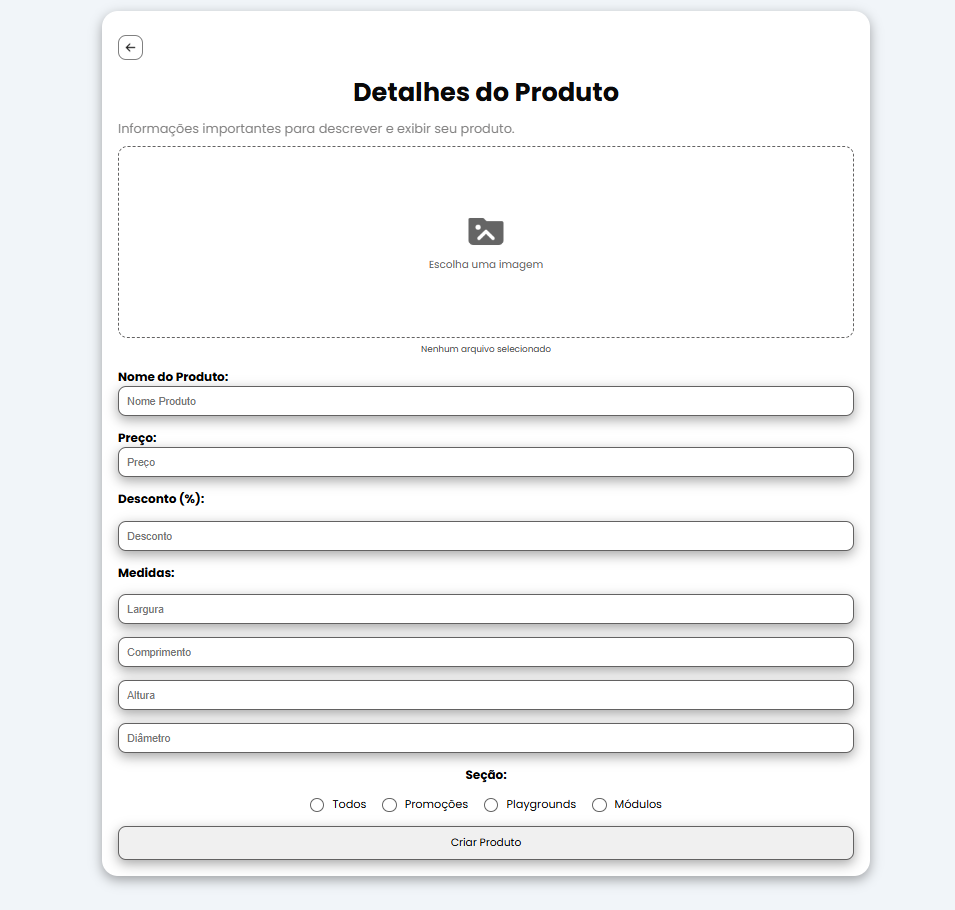

# Dashboard

## Visão Geral

O projeto do dashboard é uma das partes mais integradas com o backend. Ele utiliza praticamente todos os recursos disponibilizados pela API desenvolvida, sendo acessível conforme o nível de permissão do usuário, especialmente para administradores.

O dashboard é o ambiente onde a empresa consegue administrar os dados do sistema, incluindo informações vindas da própria API e também do e-commerce. Todo o ecossistema do projeto é interligado (e-commerce, dashboard, mobile e API), e o dashboard centraliza essas informações para facilitar a visualização e o controle.

A aplicação permite gerenciar diferentes tipos de dados de forma prática, sendo uma peça fundamental para o funcionamento interno da empresa.

O projeto ainda está em constante evolução. Entre as melhorias planejadas estão a implementação de analytics e agentes de IA, com foco em automatizar processos e otimizar o trabalho da equipe interna.

Por estar em desenvolvimento contínuo, o dashboard tende a receber novas funcionalidades e melhorias ao longo do tempo.

---

## Tecnologias e Segurança Utilizadas

A equipe de desenvolvimento optou por utilizar React com Vite no frontend, visando melhor desempenho, organização do código e mais agilidade durante o desenvolvimento.

O uso do Vite contribui para um ambiente mais rápido, com carregamento quase instantâneo durante o desenvolvimento, o que facilita testes e ajustes constantes na aplicação. Já o React permite a criação de interfaces dinâmicas e reutilizáveis, melhorando a manutenção do código e a escalabilidade do projeto.

Além disso, foi implementado o sistema de autenticação do Firebase para gerenciar o login dos usuários na plataforma do dashboard, trazendo mais segurança para o projeto.

A aplicação também utiliza Token JWT, garantindo que cada usuário acesse apenas as rotas permitidas de acordo com seu nível de permissão, seja como usuário comum ou administrador.

---

## Funcionalidades

Atualmente, o projeto conta com três funcionalidades principais:

- Login com o Google

  - Sistema completo de autenticação utilizando Google, além de login tradicional com validação de dados e recuperação de senha para usuários que esqueceram suas credenciais.  
  - Também foi implementado rate limiting para evitar excesso de requisições e aumentar a segurança do sistema.

- CRUD Completo

  - Sistema completo de gerenciamento de produtos, permitindo criar, editar, excluir e visualizar itens.  
  - Integração com o Cloudinary para gerenciamento de imagens, onde o upload é feito pelo dashboard, enviado para a API e armazenado no serviço externo.  
  - O sistema utiliza apenas a URL retornada pelo Cloudinary para exibir as imagens, evitando sobrecarga no armazenamento interno da aplicação.

- Administração de Usuários

  - Sistema de controle de usuários, com uma área restrita para administradores.  
  - Permite gerenciar permissões, excluir usuários e promover usuários comuns para administradores.  
  - Para ações mais sensíveis, como exclusão ou promoção, é solicitado um nível adicional de validação por meio de senha, exibido em um modal, garantindo maior controle de acesso.

O projeto também possui melhorias planejadas, como a integração com ferramentas de analytics para monitoramento do e-commerce diretamente no dashboard, além da implementação de um agente de IA para otimizar o atendimento e processos internos.

---

## Estrutura

O projeto do dashboard segue a mesma organização utilizada no e-commerce, com uma estrutura baseada em pastas bem definidas.

Existe uma pasta dedicada para componentes reutilizáveis, o que facilita o reaproveitamento de partes do sistema e torna o desenvolvimento mais ágil.

Essa padronização contribui para manter o código organizado, facilitando a manutenção e futuras melhorias no projeto.

---

## Integração com Backend

O backend é essencial para o funcionamento do sistema, já que todo o dashboard é baseado na comunicação com a API. Por isso, é fundamental que ambos estejam bem alinhados para garantir o funcionamento correto da aplicação.

A integração com a API levou cerca de cinco dias para ser concluída, principalmente pela quantidade de funcionalidades que dependem de requisições e pela necessidade de adaptar diferentes partes do sistema.

Um dos pontos que exigiu mais atenção foi a integração com o Cloudinary. Apesar de ser possível utilizar URLs externas para imagens, isso tornaria o gerenciamento mais trabalhoso, considerando a quantidade de produtos. Com a implementação do Cloudinary, o processo de upload e organização das imagens ficou muito mais rápido e prático.

Dentro de todo o projeto, o dashboard foi uma das partes mais desafiadoras de configurar, pois precisa se integrar com diferentes plataformas, como o e-commerce e o mobile. Após alguns ajustes, a integração foi concluída com sucesso e atualmente o sistema está funcionando de forma estável.

---

## Demonstração

### Login

Sistema de login utilizando autenticação com Google via Firebase, além de suporte para recuperação de senha por e-mail, permitindo que o usuário redefina suas credenciais de forma segura.

---

### Página Inicial (Home)

Página inicial do dashboard, onde é possível visualizar todos os produtos cadastrados no sistema, além de editar ou excluir informações de forma prática.

---

### Criar novos usuários / Lista de usuários

Sistema de criação de novos usuários de forma simples, adequado para uma plataforma com acesso restrito a poucas pessoas.

Também conta com uma listagem completa dos usuários cadastrados, facilitando o controle de acesso e a identificação de possíveis acessos indevidos.

---

### Publicar novos produtos

Sistema de cadastro de novos produtos integrado com múltiplas plataformas. Os produtos criados no dashboard são refletidos tanto no e-commerce quanto no mobile, mantendo todas as aplicações sincronizadas.

---

## Observações

Esta aplicação ainda está em desenvolvimento e em fase de testes. Trata-se de uma plataforma privada, por isso alguns detalhes não podem ser totalmente expostos.

Ainda há melhorias planejadas no design e, conforme o projeto evoluir, as imagens de demonstração também serão atualizadas.

As imagens acima representam o funcionamento atual do sistema.