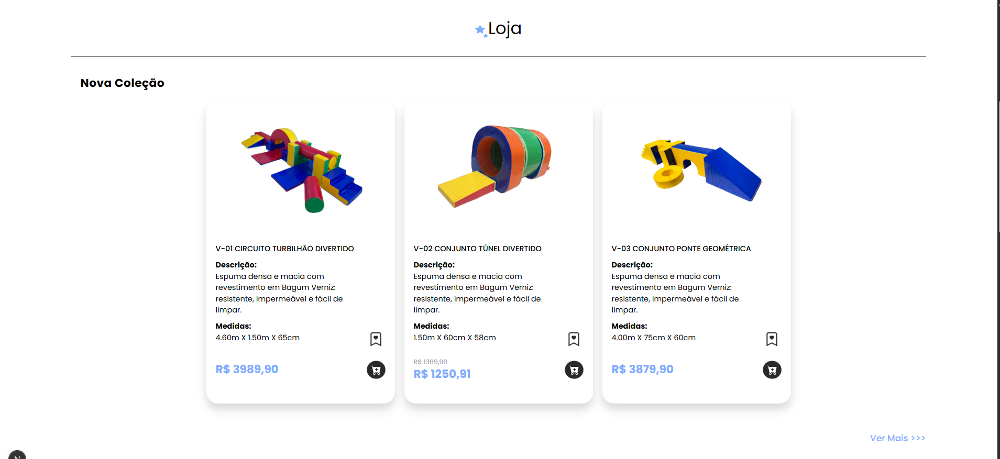
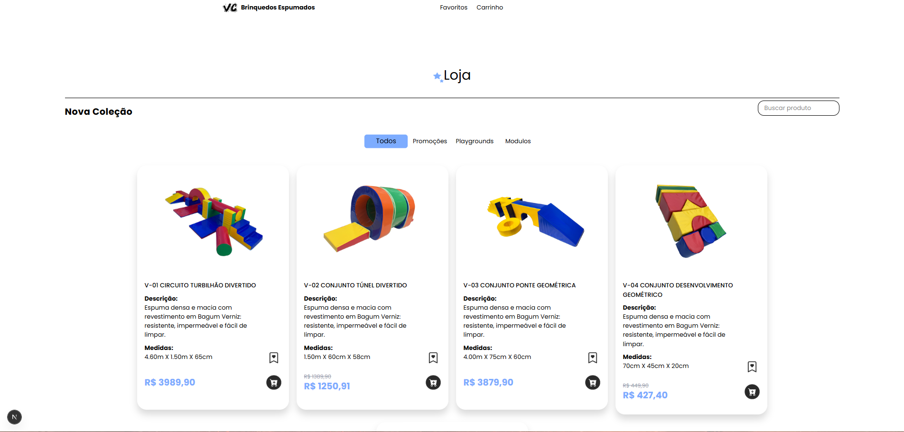
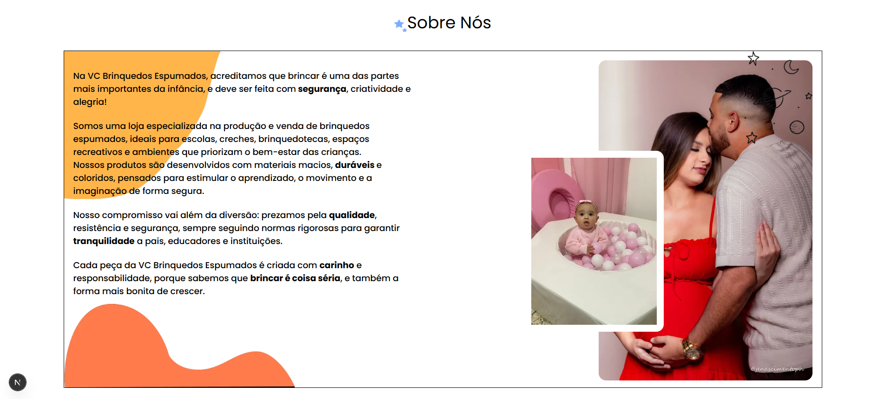
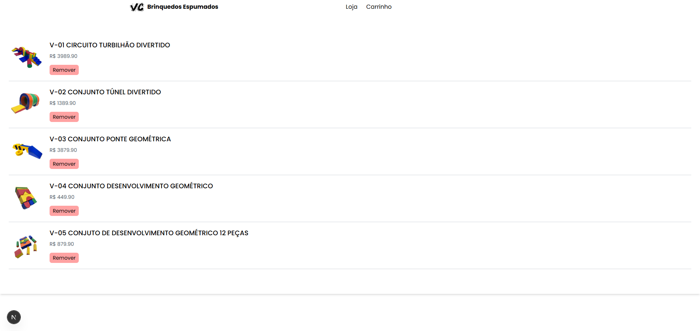
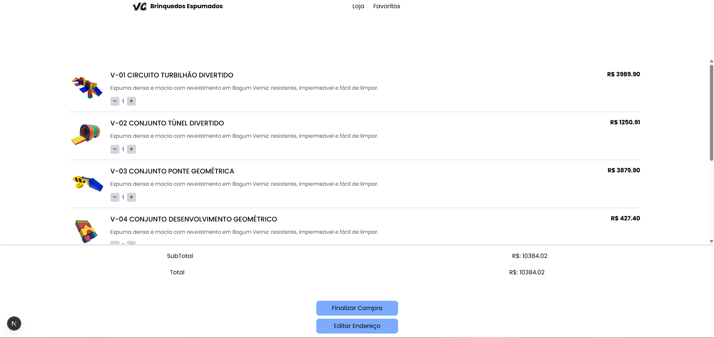
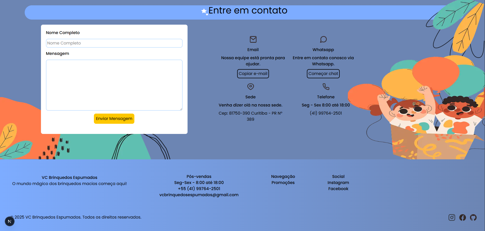

# E-commerce

## Visão Geral

O principal objetivo desta aplicação é desenvolver um e-commerce com um design limpo e intuitivo, transmitindo confiança ao cliente no momento da compra.

Além disso, a solução busca auxiliar a empresa na exibição dos produtos e na coleta de informações do usuário, como endereço, permitindo melhorar o atendimento e possibilitando o cálculo de frete de forma mais ágil.

---

## Tecnologias Utilizadas

O desenvolvimento deste e-commerce foi realizado utilizando Next.js e Tailwind CSS, tecnologias amplamente utilizadas por oferecerem praticidade, bom desempenho e facilidade de manutenção.

O Next.js contribui para uma navegação mais rápida e organizada, além de facilitar a estruturação do projeto e o gerenciamento das páginas da aplicação. Outro ponto importante é que ele renderiza melhor o conteúdo da página, o que facilita a leitura das informações pelos navegadores e mecanismos de busca, tornando o site mais fácil de ser encontrado.

Já o Tailwind CSS permite a criação de interfaces modernas e responsivas de forma ágil, mantendo um padrão visual consistente e facilitando ajustes no design.

A escolha dessas tecnologias proporciona uma melhor experiência para o usuário e torna o sistema mais fácil de evoluir e manter ao longo do tempo.

---

## Funcionalidades

- Catálogo de produtos contendo:
  - Barra de navegação por categorias
  - Barra de pesquisa
- Página de favoritos
- Carrinho de compras contendo:
  - Pop-up para inserção de informações do usuário
- Geração de mensagem pronta para envio com:
  - Endereço do cliente
  - Produtos selecionados

Atualmente, o processo de compra é realizado via WhatsApp, com mensagens pré-configuradas para que o próprio usuário envie o pedido. Esse modelo funciona, mas pode apresentar riscos, como possíveis divergências de valores, mesmo com a conferência realizada pela equipe.

Por esse motivo, a equipe de desenvolvimento já está trabalhando em melhorias para tornar esse processo mais automatizado e seguro.

Entre as próximas funcionalidades planejadas, estão o atendimento automático via WhatsApp e o envio da mensagem somente após o cálculo completo do frete com serviços externos. No momento, essas melhorias estão em desenvolvimento.

---

## Estrutura

A estrutura do projeto segue um padrão organizado, com os ambientes bem definidos para facilitar a navegação entre pastas e arquivos.

O projeto conta com uma pasta de componentes, onde ficam os elementos reutilizáveis da interface. Isso ajuda a manter o código mais limpo, padronizado e fácil de manter.

Com essa organização, outros desenvolvedores conseguem entender rapidamente a estrutura do sistema, localizar funcionalidades e realizar alterações sem risco de se perder no projeto.

---

## Integração com o Backend

A integração com o backend é uma parte essencial deste projeto. Tanto o e-commerce quanto o dashboard se comunicam com a API, onde são realizados os cálculos e as manipulações relacionadas aos produtos.

Por isso, é fundamental que o backend esteja bem estruturado e configurado, garantindo o funcionamento correto de toda a aplicação.

A comunicação com a API foi desenvolvida de forma simples e padronizada, utilizando um único formato de requisição dentro do sistema. Isso facilita a manipulação dos dados recebidos, tanto da API quanto do banco de dados, tornando o desenvolvimento e a manutenção mais eficientes.

---

## Demonstração

### Página Inicial

Tela inicial do projeto, onde a empresa se apresenta e explica o que o usuário pode esperar ao acessar o site.

---

### Lista de Produtos (Home)

Uma prévia de produtos exibida logo no início da página principal, com o objetivo de despertar o interesse do cliente e incentivá-lo a clicar em "Ver mais" para acessar o catálogo completo.

---

### Lista de Produtos (Página de Produtos)

Página com a listagem completa dos produtos, contendo uma barra de navegação para facilitar a experiência do usuário e permitir a filtragem conforme seus interesses, além de uma busca para encontrar produtos específicos.

---

### Sobre

Seção que apresenta a empresa por trás do site, trazendo mais credibilidade e confiança para o usuário no momento de realizar uma compra.

---

### Itens Favoritos

Página onde o cliente pode salvar os produtos de seu interesse e visualizá-los posteriormente. A funcionalidade de adicionar diretamente ao carrinho ainda está em desenvolvimento, pois a equipe pretende realizar alguns ajustes no design.

---

### Carrinho

Carrinho de compras funcional, com cálculo automático dos valores, considerando produtos em promoção e preços padrão. Também possui validação de informações: caso os dados do cliente não estejam completos, o pedido não pode ser enviado. São solicitadas informações básicas, como endereço, para auxiliar no cálculo do frete.

---

### Contato

Seção dedicada ao contato, oferecendo diferentes formas para que o cliente possa tirar dúvidas e se comunicar com a empresa.

---

## Observações

Atualmente, a aplicação não está disponível para execução pública, pois ainda está em fase de desenvolvimento e implementação de novas funcionalidades.

As imagens acima representam o estado atual do sistema e demonstram as principais funcionalidades já desenvolvidas.