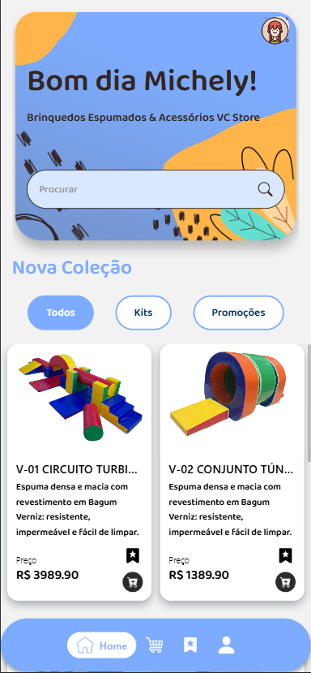
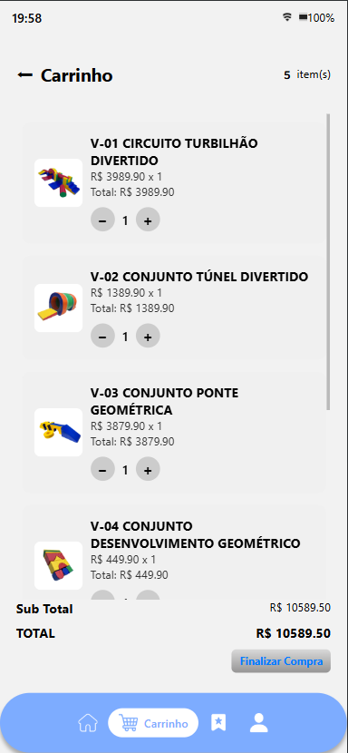
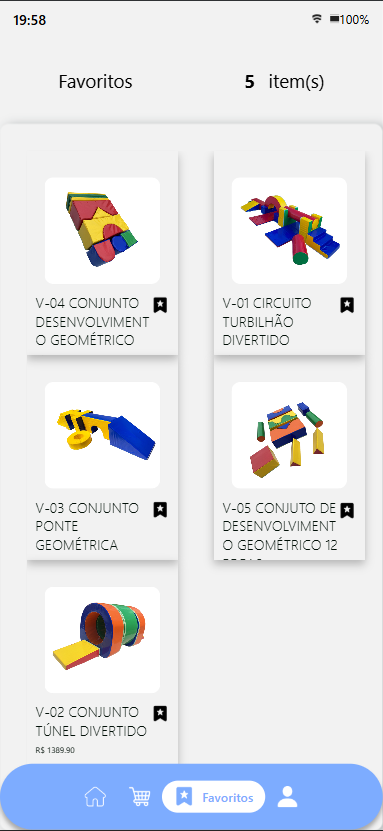
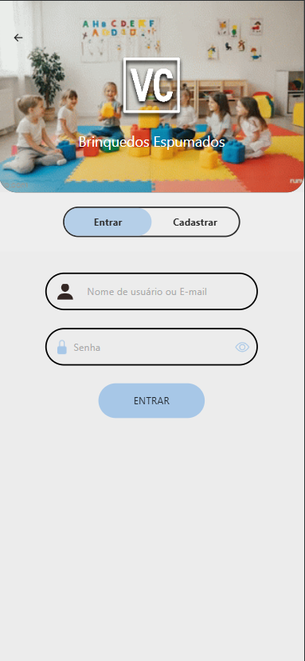
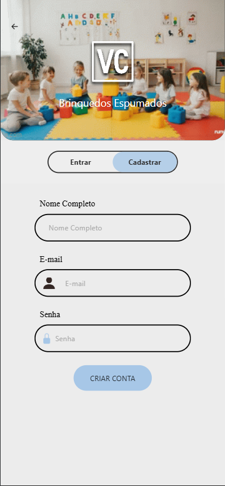

# Mobile

## Visão Geral

A aplicação mobile atualmente funciona de forma semelhante ao e-commerce, atuando como um catálogo de produtos em formato de aplicativo.

No momento, o desenvolvimento dessa aplicação está pausado, já que as principais funcionalidades estão sendo priorizadas no dashboard e no e-commerce, onde grande parte da lógica do sistema já está centralizada.

Para o futuro, a equipe de desenvolvimento, junto com a empresa, planeja evoluir o aplicativo mobile para uma ferramenta interna. A proposta é transformar o app em uma solução voltada para uso da empresa e de parceiros, com funcionalidades específicas como cálculos internos de novos produtos, controle de materiais e outros processos utilizados no dia a dia.

Essa futura aplicação terá diferentes níveis de acesso, com áreas específicas para administradores, empresa e terceirizados, com o objetivo de otimizar o tempo e melhorar a organização dos processos internos.

Por se tratar de um projeto futuro, o desenvolvimento do mobile está temporariamente em segundo plano.

---

## Tecnologias Utilizadas

A aplicação mobile foi desenvolvida utilizando React Native, principalmente pela familiaridade da equipe com o React, o que facilitou o desenvolvimento inicial e a adaptação do projeto.

Como o projeto ainda está em evolução, há planos futuros de migração para o Flutter, buscando maior flexibilidade e melhor adaptação para aplicações mais robustas.

Além disso, o banco de dados também poderá ser alterado para SQL Server, considerando que a aplicação será utilizada como ferramenta interna da empresa, lidando com dados mais estruturados e fixos.

Também está prevista a criação de uma nova API, por se tratar de um projeto com objetivos diferentes do e-commerce e do dashboard. Isso permitirá a adoção de novas tecnologias, como agentes de IA, para auxiliar a equipe interna da empresa e também os parceiros terceirizados, otimizando processos, reduzindo tempo de execução e melhorando a eficiência operacional.

---

## Funcionalidades

Atualmente, a aplicação mobile segue uma estrutura semelhante ao e-commerce, compartilhando algumas funcionalidades principais:

- Catálogo de produtos  
- Adição de itens aos favoritos  
- Carrinho de compras  

Como diferencial em relação ao e-commerce, a aplicação mobile conta com:

- Sistema de login e cadastro de usuários  
- CRUD integrado para manipulação de dados  

Mesmo sendo projetos parecidos em sua base, a equipe de desenvolvimento optou por incluir essas funcionalidades adicionais no mobile, tornando a aplicação mais completa e independente.

Ainda assim, ambos os projetos mantêm uma estrutura semelhante, facilitando a integração e o reaproveitamento de funcionalidades.

---

## Estrutura

A organização do projeto segue o mesmo padrão das outras aplicações, utilizando uma estrutura baseada em pastas bem definidas.

Há separação de componentes reutilizáveis, imagens e também uma pasta dedicada à comunicação com a API, facilitando a integração e a manutenção do código.

Essa padronização contribui para um desenvolvimento mais organizado e permite que outros desenvolvedores entendam e naveguem pelo projeto com mais facilidade.

---

## Integração com Backend

A integração com o backend foi mais tranquila em comparação com os outros projetos, já que a equipe já possuía experiência prévia com a mesma API.

Algumas partes do código foram reaproveitadas e adaptadas para o React Native. Apesar de React e React Native terem conceitos semelhantes, ainda existem diferenças importantes por se tratarem de tecnologias distintas.

Com o apoio de pesquisas e materiais de estudo, a equipe conseguiu realizar a integração completa com o backend de forma eficiente e sem grandes dificuldades.

---

## Demonstração

### Página Inicial

Página inicial acessada com uma conta de teste, onde o usuário já visualiza diretamente a lista de produtos disponíveis no sistema. 

Também conta com uma barra de pesquisa, permitindo que o cliente encontre produtos de forma mais rápida e intuitiva, melhorando a navegação dentro do aplicativo.

---

### Carrinho de Compras

Seção responsável por armazenar todos os produtos que o cliente deseja adquirir. 

O carrinho permite visualizar os itens selecionados de forma organizada, facilitando o controle antes de finalizar o pedido.

---

### Favoritos

Funcionalidade que permite ao usuário salvar produtos de interesse para visualização futura.  

Isso ajuda o cliente a organizar suas preferências e acessar rapidamente os itens desejados.

---

### Login / Cadastro

Sistema de autenticação simples, permitindo que o usuário acesse sua conta de forma segura.

O cadastro de novos usuários está temporariamente desativado nesta versão do aplicativo, pois a equipe optou por centralizar o gerenciamento de contas no dashboard, garantindo maior controle e segurança sobre os acessos.

  
  

---

## Observações

Atualmente, a aplicação mobile ainda está em desenvolvimento e pode passar por mudanças conforme novas funcionalidades forem sendo implementadas.

As imagens acima representam o estado atual do sistema.
